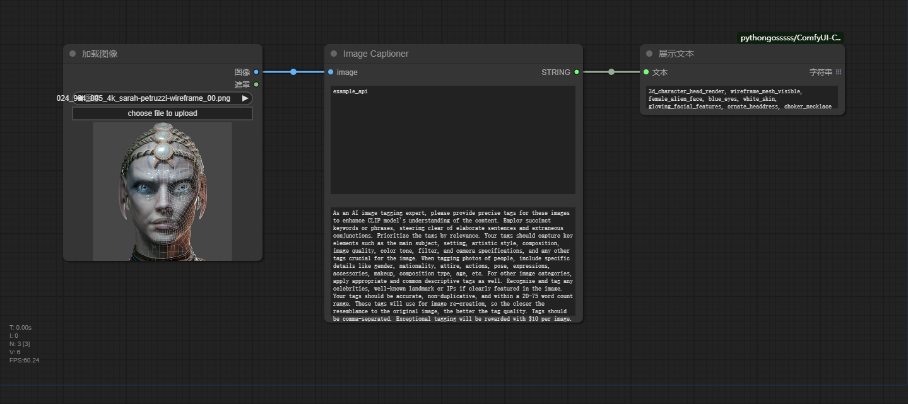

# ComfyUI ImageCaptioner

A [ComfyUI](https://github.com/comfyanonymous/ComfyUI) extension for generating captions for your images. Runs on your own system, no external services used, no filter.

Uses various VLMs with APIs to generate captions for images. You can give instructions or ask questions in natural language. 

Try asking for:

* captions or long descriptions
* whether a person or object is in the image, and how many
* lists of keywords or tags
* a description of the opposite of the image

### NSFWness (FAQ #1 apparently)

The model is quite capable of analysing NSFW images and returning NSFW replies. 

It is unlikely to return an NSFW response to a SFW image, in my experience.
It seems like this is because (1) the model's output is strongly conditioned on 
the contents of the image so it's hard
to activate concepts that aren't pictured and 
(2) the VLM has had a hefty dose of safety-training.

This is probably for the best in general.  But you will not have much success asking NSFW questions about SFW images.

## Installation
1. `git clone https://github.com/ceruleandeep/ComfyUI-ImageCaptioner` into your `custom_nodes` folder 
    - e.g. `custom_nodes\ComfyUI-ImageCaptioner`  
2. Open a console/Command Prompt/Terminal etc
3. Change to the `custom_nodes/ComfyUI-ImageCaptioner` folder you just created 
    - e.g. `cd C:\ComfyUI_windows_portable\ComfyUI\custom_nodes\ComfyUI-ImageCaptioner` or wherever you have it installed
4. Run `pip install -r requirements.txt`

## Usage
Add the node via `image` -> `ImageCaptioner`  

Supports tagging and outputting multiple batched inputs.  
- **model**: The VLM model to use. 
- **prompt**: Question to ask the VLM
- **max_tokens** Maximum length of response, in tokens. A token is approximately half a word.
- **temperature** How much randomness to allow in the result.

## Requirements
U need to get the API of dashscope from the [document](https://help.aliyun.com/zh/dashscope/developer-reference/acquisition-and-configuration-of-api-key?spm=a2c4g.11186623.0.0.7a32fa70GIg3tt)

## See also

* [ComfyUI-WD14-Tagger](https://github.com/pythongosssss/ComfyUI-WD14-Tagger)
